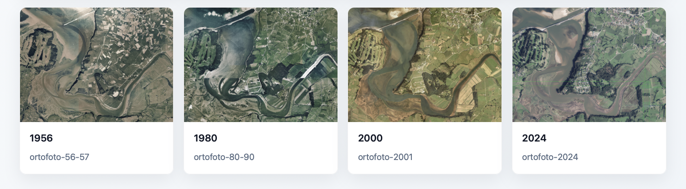

# MapVantage

A simple tool for time series analysis of geographic features form historical aerial/satellite imagery.

There are _much_ better tools out there for this task, but this does what I need it to and I learnt a lot form making it.

## View

Interactive visualizations:

- [Cantabria Delta (Oyambre & Santander)](https://amccnnll.github.io/mapvantage/projects/cantabria_delta/web/index.html)

## Sources

Imagery from *“Gobierno de Cantabria. Sistema de Información Territorial de Cantabria (SITCAN)”  CC BY 4.0 License (Creative Common Attribution)* *[https://mapas.cantabria.es](https://mapas.cantabria.es)*
